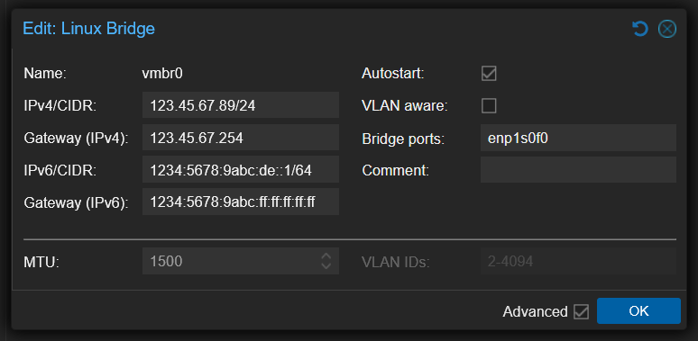

The objective of this guide is to set up a Proxmox at a hoster who gives you only one public IPv4 IP and (officially) a single /128 IPv6 IP on a dedicated server.  
The end result should be that all VMs and LXC containers should have their own IPv6 IPs.

### Overview
The external network (VMBR0) has a public IPv4 and a public IPv6 available:

```bash
IPv4 network: 123.45.67.89/24
IPv6 network: 1234:5678:9abc:de::1/128 # (officially /128, really /64)
```

The thing is, the IPv6 assigned is still /64 but the rest of the IPs are not directly accessible by the VMs and containers. A quick way to check this is the following script: [Open in github](https://gist.github.com/loayai/8eb1fa456246202a4deece7780725da6)


<details>
<summary>Click to expand code</summary>

```bash
#!/bin/bash
#===============================================================================
# IPv6 /64 Access Verification for OVH/Kimsufi
#===============================================================================
# Automatically tests if you have full /64 access (not just /128)
# Tests by adding temporary addresses and verifying they work
# Claude Opus 4.5 generated code
#===============================================================================

set -e

# Colors
RED='\033[0;31m'
GREEN='\033[0;32m'
YELLOW='\033[1;33m'
CYAN='\033[0;36m'
NC='\033[0m'
BOLD='\033[1m'

# Configuration
PING_COUNT=2
PING_TIMEOUT=3
TEST_ADDRESSES=5  # How many test addresses to try

#===============================================================================
# Helper Functions
#===============================================================================
print_pass() { echo -e "  ${GREEN}✓${NC} $1"; }
print_fail() { echo -e "  ${RED}✗${NC} $1"; }
print_warn() { echo -e "  ${YELLOW}⚠${NC} $1"; }
print_info() { echo -e "  ${CYAN}ℹ${NC} $1"; }

cleanup() {
    # Remove any test addresses we added
    if [ -n "$CLEANUP_ADDRS" ]; then
        for addr in $CLEANUP_ADDRS; do
            ip addr del "$addr" dev "$INTERFACE" 2>/dev/null || true
        done
    fi
}

trap cleanup EXIT

#===============================================================================
# Detect IPv6 Configuration
#===============================================================================
detect_ipv6_config() {
    echo -e "\n${CYAN}${BOLD}▶ Detecting IPv6 Configuration${NC}"
    echo "────────────────────────────────────────────────────────────────────────"
    
    # Find interface with global IPv6
    INTERFACE=$(ip -6 addr show scope global | awk -F': ' '/^[0-9]+:/ {print $2}' | head -1)
    
    if [ -z "$INTERFACE" ]; then
        print_fail "No interface with global IPv6 found"
        echo ""
        echo -e "  ${YELLOW}Your server doesn't have a global IPv6 address configured.${NC}"
        echo ""
        echo "  Possible reasons:"
        echo "  • IPv6 not assigned by your provider"
        echo "  • IPv6 available but not configured yet"
        echo "  • IPv4-only server"
        echo ""
        echo "  Current interfaces:"
        ip -6 addr show | grep -E "^[0-9]+:|inet6" | head -20
        echo ""
        echo "  To check if your provider offers IPv6:"
        echo "  • Check your provider's control panel"
        echo "  • Look for IPv6 settings or network configuration"
        echo "  • Contact support to request IPv6"
        exit 1
    fi
    print_info "Interface: ${BOLD}$INTERFACE${NC}"
    
    # Get primary IPv6 address and prefix using awk (more reliable than grep -P)
    local addr_line=$(ip -6 addr show dev "$INTERFACE" scope global | grep 'inet6' | head -1)
    PRIMARY_IPV6=$(echo "$addr_line" | awk '{print $2}' | cut -d'/' -f1)
    PRIMARY_PREFIX=$(echo "$addr_line" | awk '{print $2}' | cut -d'/' -f2)
    
    if [ -z "$PRIMARY_IPV6" ]; then
        print_fail "Could not detect IPv6 address"
        exit 1
    fi
    print_info "Primary IPv6: ${BOLD}$PRIMARY_IPV6/$PRIMARY_PREFIX${NC}"
    
    # Extract /64 prefix using Python (handles all IPv6 formats correctly)
    PREFIX_64=$(python3 -c "
import ipaddress
addr = ipaddress.IPv6Address('$PRIMARY_IPV6')
# Get the /64 network and extract just the network address
network = ipaddress.IPv6Network((addr, 64), strict=False)
# Print without the prefix length
print(str(network.network_address))
" 2>/dev/null)
    
    if [ -z "$PREFIX_64" ]; then
        print_fail "Could not calculate /64 prefix"
        exit 1
    fi
    
    print_info "Your /64 block: ${BOLD}${PREFIX_64}/64${NC}"
    
    # Get gateway
    GATEWAY=$(ip -6 route show default | awk '/via/ {print $3}' | head -1)
    if [ -n "$GATEWAY" ]; then
        print_info "Gateway: $GATEWAY"
    fi
    
    # Check current connectivity
    if ping6 -c 1 -W 2 2001:4860:4860::8888 &>/dev/null; then
        print_pass "IPv6 connectivity confirmed"
    else
        print_warn "IPv6 connectivity issues detected"
    fi
}

#===============================================================================
# Generate Test Addresses
#===============================================================================
generate_test_addresses() {
    # Generate test addresses in the /64 using Python for correct formatting
    TEST_ADDRS=()
    
    for i in $(seq 1 $TEST_ADDRESSES); do
        # Generate address like prefix::7e57:N
        local test_addr=$(python3 -c "
import ipaddress
prefix = ipaddress.IPv6Address('$PREFIX_64')
# Add offset to create test address (0x7e570001, 0x7e570002, etc.)
# This creates addresses like ::7e57:1, ::7e57:2
offset = 0x7e570000 + $i
test = ipaddress.IPv6Address(int(prefix) + offset)
print(str(test))
" 2>/dev/null)
        
        if [ -n "$test_addr" ] && [ "$test_addr" != "$PRIMARY_IPV6" ]; then
            TEST_ADDRS+=("$test_addr")
        fi
    done
    
    if [ ${#TEST_ADDRS[@]} -eq 0 ]; then
        print_fail "Could not generate test addresses"
        exit 1
    fi
    
    print_info "Generated ${#TEST_ADDRS[@]} test addresses"
}

#===============================================================================
# Test Adding Addresses
#===============================================================================
test_add_addresses() {
    echo -e "\n${CYAN}${BOLD}▶ Testing /64 Address Space${NC}"
    echo "────────────────────────────────────────────────────────────────────────"
    
    CLEANUP_ADDRS=""
    local success_count=0
    local fail_count=0
    
    local i=0
    local total=${#TEST_ADDRS[@]}
    
    while [ $i -lt $total ]; do
        local addr="${TEST_ADDRS[$i]}"
        echo -e "\n  Testing ($((i+1))/$total): ${BOLD}$addr${NC}"
        
        # Check if already exists
        if ip -6 addr show dev "$INTERFACE" | grep -q "$addr"; then
            print_warn "Address already exists, skipping"
            i=$((i+1))
            continue
        fi
        
        # Try to add the address
        if ip addr add "${addr}/128" dev "$INTERFACE" 2>/dev/null; then
            CLEANUP_ADDRS="$CLEANUP_ADDRS ${addr}/128"
            print_pass "Added to interface"
            
            # Wait for address to be ready
            sleep 1
            
            # Verify it's actually there
            if ip -6 addr show dev "$INTERFACE" | grep -q "$addr"; then
                print_pass "Address is active"
                success_count=$((success_count+1))
            else
                print_fail "Address not showing on interface"
                fail_count=$((fail_count+1))
            fi
        else
            print_fail "Could not add address (permission denied?)"
            fail_count=$((fail_count+1))
        fi
        
        i=$((i+1))
    done
    
    echo ""
    ADDRS_ADDED=$success_count
    ADDRS_FAILED=$fail_count
}

#===============================================================================
# Test External Reachability
#===============================================================================
test_external_reachability() {
    echo -e "\n${CYAN}${BOLD}▶ Testing Outbound Connectivity from New Addresses${NC}"
    echo "────────────────────────────────────────────────────────────────────────"
    
    if [ "$ADDRS_ADDED" -eq 0 ]; then
        print_warn "No addresses were added, skipping connectivity test"
        return
    fi
    
    local reachable_count=0
    local i=0
    local total=${#TEST_ADDRS[@]}
    
    while [ $i -lt $total ]; do
        local addr="${TEST_ADDRS[$i]}"
        
        # Check if this address is on the interface
        if ! ip -6 addr show dev "$INTERFACE" | grep -q "$addr"; then
            i=$((i+1))
            continue
        fi
        
        echo -e "\n  From: ${BOLD}$addr${NC}"
        
        # Test outbound ping using this source address
        if ping6 -c $PING_COUNT -W $PING_TIMEOUT -I "$addr" 2001:4860:4860::8888 &>/dev/null; then
            print_pass "Outbound connectivity works"
            reachable_count=$((reachable_count+1))
        else
            print_warn "Outbound ping failed (may still work - OVH NDP quirk)"
        fi
        
        i=$((i+1))
    done
    
    ADDRS_REACHABLE=$reachable_count
}

#===============================================================================
# Test NDP Behavior
#===============================================================================
test_ndp_behavior() {
    echo -e "\n${CYAN}${BOLD}▶ NDP Proxy Requirement Check${NC}"
    echo "────────────────────────────────────────────────────────────────────────"
    
    # Check if proxy_ndp is enabled
    local proxy_ndp=$(cat /proc/sys/net/ipv6/conf/all/proxy_ndp 2>/dev/null || echo "0")
    local forwarding=$(cat /proc/sys/net/ipv6/conf/all/forwarding 2>/dev/null || echo "0")
    
    if [ "$proxy_ndp" = "1" ]; then
        print_pass "NDP proxy is enabled (proxy_ndp=1)"
    else
        print_info "NDP proxy is disabled (will need for VMs)"
    fi
    
    if [ "$forwarding" = "1" ]; then
        print_pass "IPv6 forwarding is enabled"
    else
        print_info "IPv6 forwarding is disabled (will need for VMs)"
    fi
    
    # Check for ndppd
    if command -v ndppd &>/dev/null; then
        print_pass "ndppd is installed"
        if systemctl is-active --quiet ndppd 2>/dev/null; then
            print_pass "ndppd service is running"
        fi
    else
        print_info "ndppd not installed (required for VM IPv6)"
    fi
    
    echo ""
    echo -e "  ${YELLOW}${BOLD}Note on Inbound Traffic:${NC}"
    echo "  OVH uses NDP instead of routing your /64. This means:"
    echo "  • Inbound traffic to VM addresses requires NDP proxy"
    echo "  • Without ndppd, VMs won't receive incoming IPv6 traffic"
    echo "  • Outbound from VMs may work but replies won't return"
}

#===============================================================================
# Summary
#===============================================================================
print_summary() {
    echo -e "\n${CYAN}${BOLD}━━━━━━━━━━━━━━━━━━━━━━━━━━━━━━━━━━━━━━━━━━━━━━━━━━━━━━━━━━━━━━━━━━━━━━━━${NC}"
    echo -e "${CYAN}${BOLD}  SUMMARY${NC}"
    echo -e "${CYAN}${BOLD}━━━━━━━━━━━━━━━━━━━━━━━━━━━━━━━━━━━━━━━━━━━━━━━━━━━━━━━━━━━━━━━━━━━━━━━━${NC}"
    
    echo ""
    echo -e "  ${BOLD}Your IPv6 Block:${NC}  ${PREFIX_64}/64"
    echo -e "  ${BOLD}Addresses Tested:${NC} ${#TEST_ADDRS[@]}"
    echo -e "  ${BOLD}Successfully Added:${NC} $ADDRS_ADDED"
    
    if [ $ADDRS_ADDED -gt 0 ]; then
        echo ""
        echo -e "  ${GREEN}${BOLD}✓ /64 ACCESS CONFIRMED${NC}"
        echo -e "  ${GREEN}You can use the full /64 block for your VMs!${NC}"
        echo ""
        echo -e "  ${BOLD}Available range:${NC}"
        echo -e "  ${PREFIX_64} through ${PREFIX_64%::*}:ffff:ffff:ffff:ffff"
        echo ""
        echo -e "${CYAN}${BOLD}━━━━━━━━━━━━━━━━━━━━━━━━━━━━━━━━━━━━━━━━━━━━━━━━━━━━━━━━━━━━━━━━━━━━━━━━${NC}"
        echo -e "${CYAN}${BOLD}  NEXT STEPS FOR PROXMOX${NC}"
        echo -e "${CYAN}${BOLD}━━━━━━━━━━━━━━━━━━━━━━━━━━━━━━━━━━━━━━━━━━━━━━━━━━━━━━━━━━━━━━━━━━━━━━━━${NC}"
        echo ""
        echo -e "  ${BOLD}1. Install NDP Proxy daemon:${NC}"
        echo "     apt install ndppd"
        echo ""
        echo -e "  ${BOLD}2. Configure /etc/ndppd.conf:${NC}"
        echo "     ┌────────────────────────────────────────────────────┐"
        echo "     │ route-ttl 30000                                    │"
        echo "     │ proxy vmbr0 {                                      │"
        echo "     │   router yes                                       │"
        echo "     │   timeout 500                                      │"
        echo "     │   ttl 30000                                        │"
        echo "     │   rule ${PREFIX_64}/64 {"
        echo "     │     static                                         │"
        echo "     │   }                                                │"
        echo "     │ }                                                  │"
        echo "     └────────────────────────────────────────────────────┘"
        echo ""
        echo -e "  ${BOLD}3. Enable IPv6 forwarding:${NC}"
        echo "     echo 1 > /proc/sys/net/ipv6/conf/all/forwarding"
        echo ""
        echo "     For persistence, add to /etc/sysctl.conf:"
        echo "     net.ipv6.conf.all.forwarding = 1"
        echo ""
        echo -e "  ${BOLD}4. Start ndppd:${NC}"
        echo "     systemctl enable --now ndppd"
        echo ""
        echo -e "  ${BOLD}5. VM Configuration:${NC}"
        echo "     • Bridge: vmbr0"
        echo "     • IPv6: Any address from ${PREFIX_64}/64"
        echo "     • Gateway: ${PRIMARY_IPV6} (Proxmox host)"
        echo ""
        echo -e "  ${BOLD}Example VM config:${NC}"
        echo "     IPv6 Address: ${PREFIX_64%::*}::100/64"
        echo "     IPv6 Gateway: ${PRIMARY_IPV6}"
        echo ""
    else
        echo ""
        echo -e "  ${RED}${BOLD}✗ Could not verify /64 access${NC}"
        echo ""
        echo -e "  ${YELLOW}${BOLD}IMPORTANT: Not all Kimsufi servers have /64 routed!${NC}"
        echo ""
        echo "  Manual verification steps:"
        echo "  1. Ensure your host has IPv6 working first (ping6 google.com)"
        echo "  2. Try changing your address from ::1/128 to ::2/64"
        echo "  3. If you can still reach IPv6 addresses, you have /64 access"
        echo "  4. If not - bad server. Request refund and get a new one."
        echo ""
        echo "  Make sure you're running as root: sudo $0"
    fi
    
    echo ""
}

#===============================================================================
# Main
#===============================================================================
main() {
    echo -e "${CYAN}${BOLD}"
    echo "━━━━━━━━━━━━━━━━━━━━━━━━━━━━━━━━━━━━━━━━━━━━━━━━━━━━━━━━━━━━━━━━━━━━━━━━"
    echo "  IPv6 /64 Access Verification"
    echo "━━━━━━━━━━━━━━━━━━━━━━━━━━━━━━━━━━━━━━━━━━━━━━━━━━━━━━━━━━━━━━━━━━━━━━━━"
    echo -e "${NC}"
    
    # Check root
    if [ "$EUID" -ne 0 ]; then
        print_fail "This script must be run as root"
        echo "  Run: sudo $0"
        exit 1
    fi
    
    # Check for Python3 (required for reliable IPv6 parsing)
    if ! command -v python3 &>/dev/null; then
        print_fail "python3 is required for IPv6 address parsing"
        echo "  Install with: apt install python3"
        exit 1
    fi
    
    detect_ipv6_config
    generate_test_addresses
    test_add_addresses
    test_external_reachability
    test_ndp_behavior
    print_summary
}

main "$@"

```
</details>

So if the script works, it'll give you the steps needed to setup additional IPs. Lets go through them one by one.

### Change Proxmox node IPv6 subnet

First, change your server's IPv6 IP subnet from /128 to /64 in proxmox UI, usually for `vmbr0`

Add the following content, replace `1234:5678:9abc:de::` with your server's IPv6 IP:




### Setup ndppd proxy

This is used as we cant use the provided OVH gateway as a proxy. So we setup ndppd to use our dedicated server as a proxy.

```bash
apt update
apt install ndppd nano
```

Configure it by creating/editing: `/etc/ndppd.conf`

```bash
nano /etc/ndppd.conf
```

Add:

```bash
route-ttl 30000

proxy vmbr0 {
  router yes
  timeout 500
  ttl 30000

  rule 1234:5678:9abc:de::/64 {
    static
  }
}
```

Then allow IPv6 forwarding:

```bash
nano /etc/sysctl.d/99-ipv6-routing.conf
```

Add:

```bash
net.ipv6.conf.all.forwarding = 1
```

Apply these sysctl changes:

```bash
sysctl --system
```

Finally enable ndppd to start on boot and start it now as well:

```bash
systemctl enable --now ndppd
```

That's all changes needed from proxmox.


### Add IPv6 only VM or LXC container:

Create a VM or LXC container as normal, using `vmbr0` as network bridge. Then when setting up IPv6 for the VM/LXC, use the following settings:

```bash
IP: 1234:5678:9abc:de::xxx/64
Gateway: 1234:5678:9abc:de::1
```

> **Note:**<br> 
  We are using our proxmox node's IPv6 address as gateway on `vmbr0` which is the default network bridge.<br>
  We can use any IPv6 IP starting with the first 4 parts of the host's IPv6 IP. For example, this is a valid IP for our VM/LXC container:<br>
  `1234:5678:9abc:de:1234:5678:90ab:cde0`