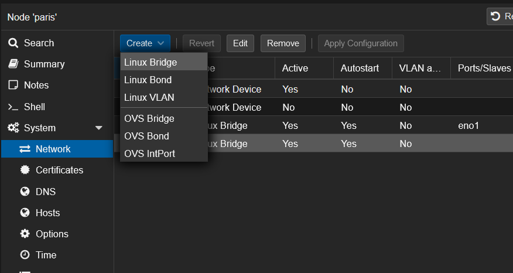
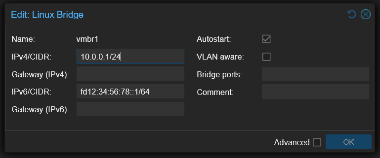

The goal of this guide is to set up a Proxmox at a hoster who gives you only one public IP (V4 and / or V6) on a dedicated server.  
The goal is that all virtual machines have Internet and that you can forward port to them.


### Overview
The external network (VMBR0) has a public IPv4 and a public IPv6 available:

```bash
IPv4 network: 123.45.67.89/24
IPv6 network: 1234:5678:9abc:de::1/128
```

Before starting, we need to create a private network.

In this guide, the internal network (VMBR1) will have IPv4 and IPv6:

```bash
IPv4 network: 10.0.0.1/24
IPv6 network: fd12:34:56:78::1/64
```
The communication will behave like this: **VMBR0 <-> VMBR1 <-> Virtual machines**.

The virtual machines will have address on the internal network (VMBR1), here is an example for a virtual machine:

```bash
iface ens18 inet static
        address 10.0.0.104/24
        gateway 10.0.0.1
        dns-nameservers 1.1.1.1 1.0.0.1


iface ens18 inet6 static
        address fd12:34:56:78::104/64
        gateway fd12:34:56:78::1
        dns-nameservers 2606:4700:4700::1111 2606:4700:4700::1001
```

The Proxmox will manage the NAT.


### Configuring UFW firewall
To protect Proxmox, we will install UFW (this is not mandatory, but do it anyway).

Install UFW:

```bash
apt install ufw -y
```

Open the default config file:

```bash
nano /etc/default/ufw
```

Configure the following options:

```bash
IPV6=yes
DEFAULT_FORWARD_POLICY="ACCEPT"
```

Then open this configuration file:

```bash
nano /etc/ufw/sysctl.conf
```


And configure the following lines:

```bash
net/ipv4/ip_forward=1
net/ipv6/conf/default/forwarding=1
net/ipv6/conf/all/forwarding=1
```


Disable the firewall:

```bash
ufw disable
```


Allow all outside connections and deny all incoming connections:

```bash
ufw default deny incoming
ufw default allow outgoing
ufw allow in on vmbr1 to any
```


If you have a fixed IP address at home, you can allow all connections from it:

```bash
ufw allow from 45.23.28.24
```


If you don't have fixed ip, allow all connections, but to selected ports to SSH and Proxmox:

```bash
ufw allow 22
ufw allow 8006
```


Finally, enable the firewall:

```bash
ufw enable
```


### Internal Network setup (VMBR1)
Open the Proxmox web interface and create the new interface from here (**System** -> **Network** -> **Create** -> **Linux Bridge**):





Configure the interface like this with the private networks we've seen before:




You will seen that I don't put a **Bridge port**.  
If you put a virtual machine or virtual switch on **VMBR0** without additional IP, it is possible than your network port will be shutdown at the datacenter.


### Routing configuration
We will configure **MASQUERADE** under Linux.  
To be easy, **MASQUERADE** is a **1-to-many NAT type**.

Behind that rude explanation is hidden the most common NAT type that you have behind your provider router and behind any firewall.  
All the computers from the internal network can go to the Internet with only one public IP address.


Open your interfaces' configuration:

```bash
nano /etc/network/interfaces
```


Add the following lines to **VMBR1** in **IPv4**:


```bash
post-up echo 1 > /proc/sys/net/ipv4/ip_forward
post-up iptables -t nat -A POSTROUTING -s 10.0.0.0/24 -o vmbr0 -j MASQUERADE
post-down iptables -t nat -D POSTROUTING -s 10.0.0.0/24 -o vmbr0 -j MASQUERADE
```


Add the following lines to **VMBR1** in **IPv6**:


```bash
post-up echo 1 > /proc/sys/net/ipv6/conf/all/forwarding
post-up ip6tables -t nat -A POSTROUTING -s fd12:34:56:78::1/64 -o vmbr0 -j MASQUERADE
post-down ip6tables -t nat -D POSTROUTING -s fd12:34:56:78::1/64 -o vmbr0 -j MASQUERADE
```


In a meaningful way, your full interface config should look just like this:


```bash
auto lo
iface lo inet loopback

iface eno1 inet manual

iface eno2 inet manual

auto vmbr0
iface vmbr0 inet static
        address 123.45.67.89/24
        gateway 123.45.67.90
        bridge-ports eno1
        bridge-stp off
        bridge-fd 0
        hwaddress 0C:C4:7A:47:DA:4C

iface vmbr0 inet6 static
        address 2001:41d0:a:53d7::1/128
        gateway 2001:41d0:000a:53ff:00ff:00ff:00ff:00ff

auto vmbr1
iface vmbr1 inet static
        address 10.0.0.1/24
        bridge-ports none
        bridge-stp off
        bridge-fd 0
        post-up echo 1 > /proc/sys/net/ipv4/ip_forward
        post-up iptables -t nat -A POSTROUTING -s 10.0.0.0/24 -o vmbr0 -j MASQUERADE
        # post-up /root/dnat.sh
        post-down iptables -t nat -D POSTROUTING -s 10.0.0.0/24 -o vmbr0 -j MASQUERADE

iface vmbr1 inet6 static
        address fd12:34:56:78::1/64
        post-up echo 1 > /proc/sys/net/ipv6/conf/all/forwarding
        post-up ip6tables -t nat -A POSTROUTING -s fd12:34:56:78::1/64 -o vmbr0 -j MASQUERADE
        post-down ip6tables -t nat -D POSTROUTING -s fd12:34:56:78::1/64 -o vmbr0 -j MASQUERADE
```

> **Note:** the `-o vmbr0` is because my proxmox server's external connection is on `-o vmbr0` so if your main interface is, lets say `eth0`, use `-o eth0` instead.

From here, **restart** your Proxmox and your virtual machines will have internet if you put fixed IP address on their network cards.


### Fixed IP setup for virtual machines
Here, we will take the case of a virtual machine under Debian 11 with the virtual network card on the **VMBR1** virtual switch:


```bash
# The loopback network interface
auto lo
iface lo inet loopback

# The primary network interface
allow-hotplug ens18
iface ens18 inet static
        address 10.0.0.104/24
        gateway 10.0.0.1
        dns-nameservers 1.1.1.1 1.0.0.1


iface ens18 inet6 static
        address fd12:34:56:78::104/64
        gateway fd12:34:56:78::1
        dns-nameservers 2606:4700:4700::1111 2606:4700:4700::1001
```


### Port forwarding to virtual machines
Here we will create a script to open ports needed on the VMs.  
The port 80 will be open in both IPv4 and IPv6 by redirecting to the IP **.104**.

Create this script for your configuration:

```bash
nano /root/dnat.sh
```


Here, open the port 80 on the virtual machine **.104** in both IPv4 and IPv6:

```bash
sleep 60
iptables -t nat -A PREROUTING -i vmbr0 -p tcp --dport 80 -j DNAT --to-destination 10.0.0.104:80
ip6tables -t nat -A PREROUTING -i vmbr0 -p tcp -m tcp --dport 80 -j DNAT --to-destination [fd12:34:56:78::104]:80
```

**iptables** manage NAT rules in **IPv4**.  
**ip6tables** manage NAT rules in **IPv6**.

Remember to chmod the file so it has execute permissions:

```bash
chmod +x /root/dnat.sh
```

Beware, if you configured UFW you also need to allow the port in the firewall:


```bash
ufw allow 80
```


Then, you need to set up the script in the interfaces' config file:


```bash
nano /etc/network/interfaces
```


Add the following lines to VMBR1 in IPv4:


```bash
post-up echo 1 > /proc/sys/net/ipv4/ip_forward
post-up iptables -t nat -A POSTROUTING -s 10.0.0.0/24 -o vmbr0 -j MASQUERADE
post-up /root/dnat.sh
post-down iptables -t nat -D POSTROUTING -s 10.0.0.0/24 -o vmbr0 -j MASQUERADE
```

Like this, the NAT will be applied at each restart.


### Summary

Here is the **/root/dnat.sh** file that I personally use:

```bash
sleep 60

# SSH IPv4
iptables -t nat -A PREROUTING -i vmbr0 -p tcp --dport 10122 -j DNAT --to-destination 10.0.0.101:22
iptables -t nat -A PREROUTING -i vmbr0 -p tcp --dport 10222 -j DNAT --to-destination 10.0.0.102:22
iptables -t nat -A PREROUTING -i vmbr0 -p tcp --dport 10322 -j DNAT --to-destination 10.0.0.103:22
iptables -t nat -A PREROUTING -i vmbr0 -p tcp --dport 10422 -j DNAT --to-destination 10.0.0.104:22
iptables -t nat -A PREROUTING -i vmbr0 -p tcp --dport 10522 -j DNAT --to-destination 10.0.0.105:22
iptables -t nat -A PREROUTING -i vmbr0 -p tcp --dport 10622 -j DNAT --to-destination 10.0.0.106:22
iptables -t nat -A PREROUTING -i vmbr0 -p tcp --dport 10722 -j DNAT --to-destination 10.0.0.107:22
iptables -t nat -A PREROUTING -i vmbr0 -p tcp --dport 10822 -j DNAT --to-destination 10.0.0.108:22
iptables -t nat -A PREROUTING -i vmbr0 -p tcp --dport 10922 -j DNAT --to-destination 10.0.0.109:22
iptables -t nat -A PREROUTING -i vmbr0 -p tcp --dport 11022 -j DNAT --to-destination 10.0.0.110:22

# SSH IPv6
ip6tables -t nat -A PREROUTING -i vmbr0 -p tcp --dport 10122 -j DNAT --to-destination [fd12:34:56:78::101]:22
ip6tables -t nat -A PREROUTING -i vmbr0 -p tcp --dport 10222 -j DNAT --to-destination [fd12:34:56:78::102]:22
ip6tables -t nat -A PREROUTING -i vmbr0 -p tcp --dport 10322 -j DNAT --to-destination [fd12:34:56:78::103]:22
ip6tables -t nat -A PREROUTING -i vmbr0 -p tcp --dport 10422 -j DNAT --to-destination [fd12:34:56:78::104]:22
ip6tables -t nat -A PREROUTING -i vmbr0 -p tcp --dport 10522 -j DNAT --to-destination [fd12:34:56:78::105]:22
ip6tables -t nat -A PREROUTING -i vmbr0 -p tcp --dport 10622 -j DNAT --to-destination [fd12:34:56:78::106]:22
ip6tables -t nat -A PREROUTING -i vmbr0 -p tcp --dport 10722 -j DNAT --to-destination [fd12:34:56:78::107]:22
ip6tables -t nat -A PREROUTING -i vmbr0 -p tcp --dport 10822 -j DNAT --to-destination [fd12:34:56:78::108]:22
ip6tables -t nat -A PREROUTING -i vmbr0 -p tcp --dport 10922 -j DNAT --to-destination [fd12:34:56:78::109]:22
ip6tables -t nat -A PREROUTING -i vmbr0 -p tcp --dport 11022 -j DNAT --to-destination [fd12:34:56:78::110]:22


# Reverse proxy
iptables -t nat -A PREROUTING -i vmbr0 -p tcp --dport 80 -j DNAT --to-destination 10.0.0.101:80
iptables -t nat -A PREROUTING -i vmbr0 -p tcp --dport 81 -j DNAT --to-destination 10.0.0.101:81
iptables -t nat -A PREROUTING -i vmbr0 -p tcp --dport 443 -j DNAT --to-destination 10.0.0.101:443
ip6tables -t nat -A PREROUTING -i vmbr0 -p tcp -m tcp --dport 80 -j DNAT --to-destination [fd12:34:56:78::101]:80
ip6tables -t nat -A PREROUTING -i vmbr0 -p tcp -m tcp --dport 81 -j DNAT --to-destination [fd12:34:56:78::101]:81
ip6tables -t nat -A PREROUTING -i vmbr0 -p tcp -m tcp --dport 443 -j DNAT --to-destination [fd12:34:56:78::101]:443


# Portainer
iptables -t nat -A PREROUTING -i vmbr0 -p tcp --dport 9443 -j DNAT --to-destination 10.0.0.101:9443
ip6tables -t nat -A PREROUTING -i vmbr0 -p tcp -m tcp --dport 9443 -j DNAT --to-destination [fd12:34:56:78::101]:9443


# IPv4 Webhost + Mailserver + DNS + Virtualmin + Webmin
iptables -t nat -A PREROUTING -i vmbr0 -p tcp --dport 25 -j DNAT --to-destination 10.0.0.102:25 # SMTP
iptables -t nat -A PREROUTING -i vmbr0 -p tcp --dport 53 -j DNAT --to-destination 10.0.0.102:53 # DNS
iptables -t nat -A PREROUTING -i vmbr0 -p tcp --dport 143 -j DNAT --to-destination 10.0.0.102:143 # IMAP
iptables -t nat -A PREROUTING -i vmbr0 -p tcp --dport 465 -j DNAT --to-destination 10.0.0.102:465 # SMTP over SSL
iptables -t nat -A PREROUTING -i vmbr0 -p tcp --dport 587 -j DNAT --to-destination 10.0.0.102:587 # SMTP submission
iptables -t nat -A PREROUTING -i vmbr0 -p tcp --dport 853 -j DNAT --to-destination 10.0.0.102:853 # DNS over TLS
iptables -t nat -A PREROUTING -i vmbr0 -p tcp --dport 993 -j DNAT --to-destination 10.0.0.102:993 # IMAP over SSL
iptables -t nat -A PREROUTING -i vmbr0 -p tcp --dport 995 -j DNAT --to-destination 10.0.0.102:995 # POP3 over SSL
iptables -t nat -A PREROUTING -i vmbr0 -p tcp --dport 10000 -j DNAT --to-destination 10.0.0.102:10000 # Virtualmin
iptables -t nat -A PREROUTING -i vmbr0 -p tcp --dport 20000 -j DNAT --to-destination 10.0.0.102:20000 # Webmin

# IPv6 Webhost + Mailserver + DNS + Virtualmin + Webmin
ip6tables -t nat -A PREROUTING -i vmbr0 -p tcp --dport 25 -j DNAT --to-destination [fd12:34:56:78::102]:25 # SMTP
ip6tables -t nat -A PREROUTING -i vmbr0 -p tcp --dport 53 -j DNAT --to-destination [fd12:34:56:78::102]:53 # DNS
ip6tables -t nat -A PREROUTING -i vmbr0 -p tcp --dport 143 -j DNAT --to-destination [fd12:34:56:78::102]:143 # IMAP
ip6tables -t nat -A PREROUTING -i vmbr0 -p tcp --dport 465 -j DNAT --to-destination [fd12:34:56:78::102]:465 # SMTP over SSL
ip6tables -t nat -A PREROUTING -i vmbr0 -p tcp --dport 587 -j DNAT --to-destination [fd12:34:56:78::102]:587 # SMTP submission
ip6tables -t nat -A PREROUTING -i vmbr0 -p tcp --dport 853 -j DNAT --to-destination [fd12:34:56:78::102]:853 # DNS over TLS
ip6tables -t nat -A PREROUTING -i vmbr0 -p tcp --dport 993 -j DNAT --to-destination [fd12:34:56:78::102]:993 # IMAP over SSL
ip6tables -t nat -A PREROUTING -i vmbr0 -p tcp --dport 995 -j DNAT --to-destination [fd12:34:56:78::102]:995 # POP3 over SSL
ip6tables -t nat -A PREROUTING -i vmbr0 -p tcp --dport 10000 -j DNAT --to-destination [fd12:34:56:78::102]:10000 # Virtualmin
ip6tables -t nat -A PREROUTING -i vmbr0 -p tcp --dport 20000 -j DNAT --to-destination [fd12:34:56:78::102]:20000 # Webmin


# VPN
iptables -t nat -A PREROUTING -i vmbr0 -p udp --dport 2194 -j DNAT --to-destination 10.0.0.103:2194
ip6tables -t nat -A PREROUTING -i vmbr0 -p udp -m udp --dport 2194 -j DNAT --to-destination [fd12:34:56:78::103]:2194
```


The complete proxmox host interface file looks like this:


```bash
auto lo
iface lo inet loopback

iface eno1 inet manual

iface eno2 inet manual

auto vmbr0
iface vmbr0 inet static
        address 123.45.67.89/24
        gateway 123.45.67.90
        bridge-ports eno1
        bridge-stp off
        bridge-fd 0
        hwaddress 0C:C4:7A:47:DA:4C

iface vmbr0 inet6 static
        address 2001:41d0:a:53d7::1/128
        gateway 2001:41d0:000a:53ff:00ff:00ff:00ff:00ff

auto vmbr1
iface vmbr1 inet static
        address 10.0.0.1/24
        bridge-ports none
        bridge-stp off
        bridge-fd 0
        post-up echo 1 > /proc/sys/net/ipv4/ip_forward
        post-up iptables -t nat -A POSTROUTING -s 10.0.0.0/24 -o vmbr0 -j MASQUERADE
        post-up /root/dnat.sh
        post-down iptables -t nat -D POSTROUTING -s 10.0.0.0/24 -o vmbr0 -j MASQUERADE

iface vmbr1 inet6 static
        address fd12:34:56:78::1/64
        post-up echo 1 > /proc/sys/net/ipv6/conf/all/forwarding
        post-up ip6tables -t nat -A POSTROUTING -s fd12:34:56:78::1/64 -o vmbr0 -j MASQUERADE
        post-down ip6tables -t nat -D POSTROUTING -s fd12:34:56:78::1/64 -o vmbr0 -j MASQUERADE
```


This is what the UFW was configured with:

```bash
#!/usr/bin/env bash
set -euo pipefail

# =========================
# UFW Base Setup
# =========================

# Enable IPv6 support in UFW (important for auto-mirroring rules)
sed -i 's/^IPV6=.*/IPV6=yes/' /etc/default/ufw

# Reset UFW (optional but recommended for clean state)
ufw --force reset

# Default policies
ufw default deny incoming
ufw default allow outgoing

# =========================
# Interface rule
# =========================
ufw allow in on vmbr1

# =========================
# TCP ports / ranges
# =========================
ufw allow 22
ufw allow 8006
ufw allow 80
ufw allow 443
ufw allow 81

# Port range (TCP)
ufw allow 2201:2210/tcp

# Mail ports (TCP)
ufw allow 25
ufw allow 143,465,587,993/tcp

# DNS TCP+UDP mix (split for clarity)
ufw allow 53
ufw allow 53,853/udp

# Other TCP ports
ufw allow 995
ufw allow 10000,20000/tcp
ufw allow 9443

# UDP port
ufw allow 2194/udp

# =========================
# Enable UFW
# =========================
ufw --force enable

# Show status
ufw status numbered
```


This is a mirrored post with some modifications from Nicolas Simond. Original post:


```bash
https://wiki.abyssproject.net/en/proxmox/proxmox-with-one-public-ip
```


